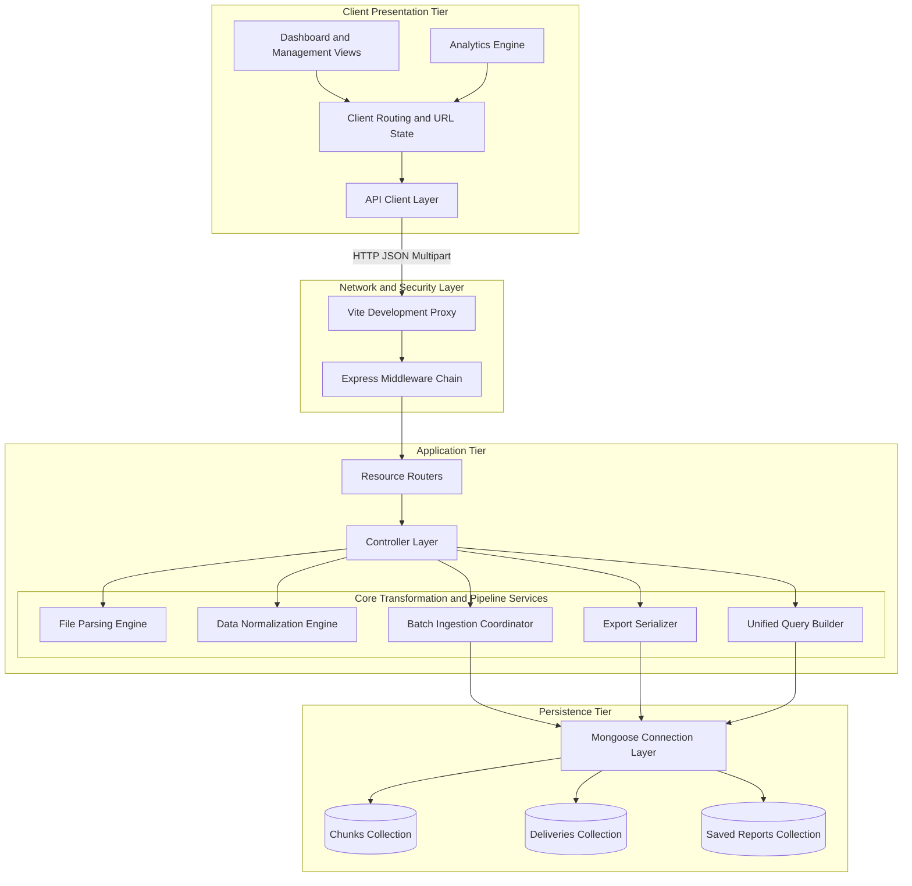
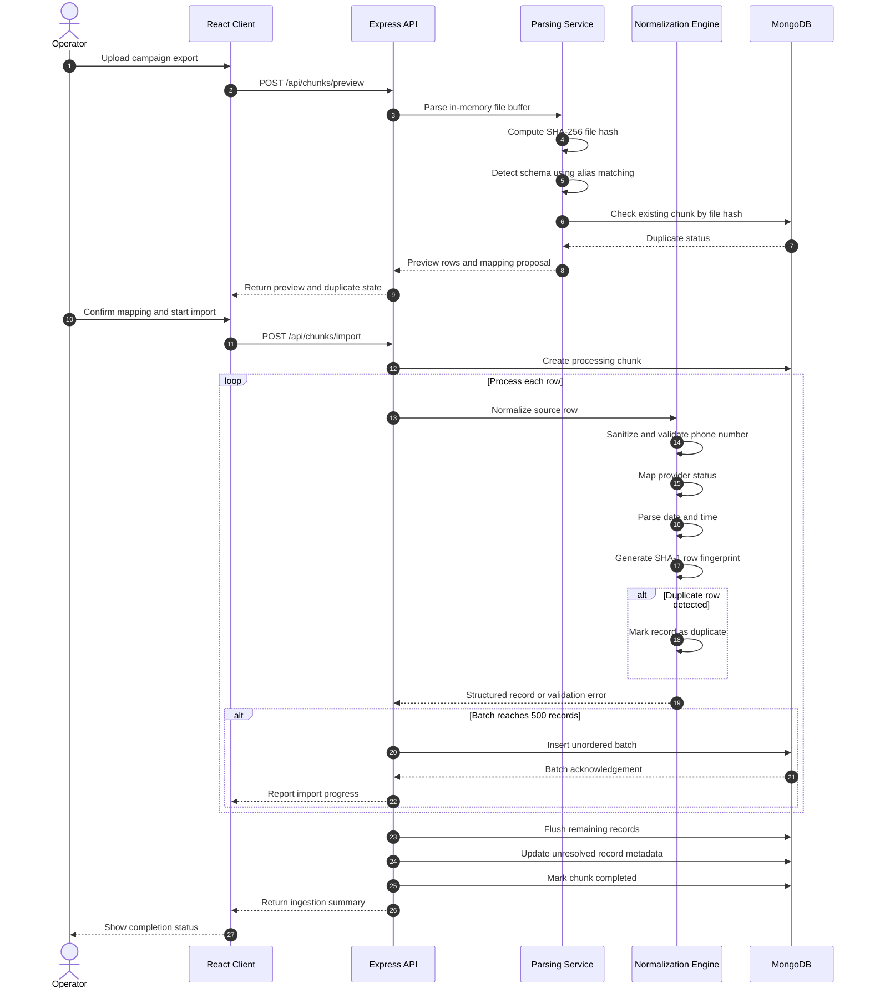
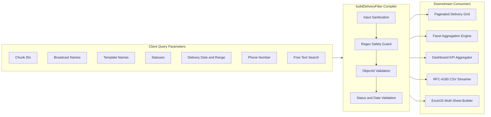

# BroadcastIQ — Operational Intelligence & Analytics Engine for WhatsApp Broadcast Infrastructure

<p align="center">
  
  
  
  
  
  
  
  
  
</p>

<p align="center">
  <strong>A full-stack operational reporting engine, high-throughput batch normalization pipeline, multi-dimensional parameterized query builder, and historical analytics platform designed for Commun WhatsApp broadcast delivery datasets.</strong>
</p>

---

## 📑 Table of Contents

- [System Overview & Problem Domain](#-system-overview--problem-domain)
- [Key Architectural Capabilities](#-key-architectural-capabilities)
- [System Architecture](#-system-architecture)
- [Ingestion & Normalization Pipeline](#-ingestion--normalization-pipeline)
- [Parameterized Query & Dynamic Filter Engine](#-parameterized-query--dynamic-filter-engine)
- [Multi-Worksheet Analytical Export Engine](#-multi-worksheet-analytical-export-engine)
- [Database Modeling & Indexing Strategy](#-database-modeling--indexing-strategy)
- [Technology Stack Matrix](#-technology-stack-matrix)
- [Core Engineering Design Decisions](#-core-engineering-design-decisions)
- [Security, Fault Tolerance & Operational Reliability](#-security-fault-tolerance--operational-reliability)
- [RESTful API Interface Specification](#-restful-api-interface-specification)
- [Repository Architecture](#-repository-architecture)
- [Engineering Roadmap](#-engineering-roadmap)
- [License & Attribution](#-license--attribution)

---

## 🌟 System Overview & Problem Domain

Operating WhatsApp broadcast marketing campaigns at scale introduces significant data heterogeneity. When delivery logs are extracted from provider platforms like Commun, files arrive as unstandardized CSV, XLS, and XLSX spreadsheets with shifting schema definitions, inconsistent column naming conventions, varied timestamp encodings, malformed telephone dial strings, and untracked duplicate rows.

Attempting to aggregate campaign metrics across batches or audit failed deliveries via traditional desktop spreadsheet software leads to data drift, silent overwrite errors, and an inability to perform point-in-time audits.

**BroadcastIQ** addresses this operational data problem by decoupling raw ingestion from persistent analytics:

1. **Defensive Schema Ingestion**: Ingests multi-format spreadsheets into memory buffers, auto-discovering schema mappings across a 30+ alias dictionary while offering pre-commit GUI mapping overrides and SHA-256 cryptographic collision checks.
2. **Deterministic Data Normalization**: Cleans and validates Indian and international telephone formats into unified digit strings, resolves 19+ raw provider status strings into 7 canonical operational states, and handles erratic date encodings (including Excel 1900-epoch floating-point serial offsets).
3. **Immutable Snapshot Persistence**: Treats each ingested file as an immutable historical batch. Records are hashed with composite SHA-1 fingerprints, ensuring duplicate deliveries are transparently audited rather than silently dropped or destructively overwritten.
4. **Unified Parameterized Querying**: A single server-side query builder translates multi-dimensional filter state across paginated UI data grids, aggregation pipelines, and OpenXML Excel/RFC-4180 CSV export builders.

```
┌──────────────────────────────────────────────────────────────────────────────────────────────────┐
│                                   OPERATIONAL FAILURE MATRIX                                     │
├──────────────────────┬──────────────────────────────────────────┬────────────────────────────────┤
│ Raw Data Artifact    │ Real-World Failure Mode                  │ BroadcastIQ Technical Solution │
├──────────────────────┼──────────────────────────────────────────┼────────────────────────────────┤
│ Header Drift         │ Exports alternate between "Sent to",     │ Two-pass heuristic dictionary  │
│                      │ "msisdn", "phone_no", and "recipient".   │ maps to canonical fields.      │
├──────────────────────┼──────────────────────────────────────────┼────────────────────────────────┤
│ Timestamp Entropy    │ Mixed 5-digit Excel serials, ISO-8601,   │ Defensive date parser computes │
│                      │ and European dd/mm/yyyy 12h strings.     │ millisecond offsets to UTC.    │
├──────────────────────┼──────────────────────────────────────────┼────────────────────────────────┤
│ Telephone Dial State │ Prefixes with +91, 0091, 910, 0, or raw  │ Regex sanitizer extracts clean │
│                      │ 10-digit formats with length anomalies.  │ digits; enforces E.164 bounds. │
├──────────────────────┼──────────────────────────────────────────┼────────────────────────────────┤
│ Destructive Updates  │ Successive imports overwrite prior logs, │ Append-only snapshots with     │
│                      │ destroying campaign historical audit.    │ SHA-1 composite fingerprints.  │
├──────────────────────┼──────────────────────────────────────────┼────────────────────────────────┤
│ Query / Export Drift │ Client UI filters differ from backend    │ Shared parameter builder for   │
│                      │ export scripts, skewing metrics.         │ UI, aggregations, and exports. │
└──────────────────────┴──────────────────────────────────────────┴────────────────────────────────┘
```

---

## ✨ Key Architectural Capabilities

- **In-Memory Buffer Processing**: Utilizes streaming buffer parsing via `csv-parse` and SheetJS (`xlsx`) backed by Multer memory storage (25 MB per-file boundary, multi-file batch upload queue).
- **Cryptographic Collision Prevention**: Calculates SHA-256 buffer digests prior to database insertion. Re-importing identical files prompts an explicit `409 Conflict` duplicate guard, preventable only via operator force flags.
- **Interactive Pre-Commit Validation**: Renders real-time schema previews on the first 20 parsed rows, enabling operators to confirm or remap field assignments before persistent writes occur.
- **Fault-Tolerant Bulk Writes**: Executes batched database ingestion in slices of 500 records via MongoDB `insertMany` (`ordered: false`), preventing payload bottlenecks and providing granular UI progress tracking.
- **Reactive Analytical Visualization**: Computes delivery distribution donuts and chunk performance bar charts dynamically through Recharts, supporting date-boundary window presets (`Today`, `Yesterday`, `7D`, `30D`, `Custom Range`).
- **Multi-Worksheet Excel Serialization**: Generates styled OpenXML workbooks via ExcelJS containing data tables with frozen header rows, auto-filters, status summary percentages, and batch audit metadata.

---

## 🏗️ Technical Architecture

BroadcastIQ uses a decoupled client-server architecture. The browser client acts as a responsive analytical dashboard communicating via a secure REST API proxy, while the Express service coordinates parsing, normalization pipelines, and aggregation queries over an indexed MongoDB persistence tier.



### Architecture Responsibilities

| Layer | Responsibility |
|---|---|
| Client Presentation | Responsive dashboards, routing, charts, filters, and API interaction |
| Network / Security | Reverse proxying, middleware enforcement, HTTP hardening, throttling, and compression |
| Application | Request orchestration, parsing, normalization, import coordination, query compilation, and export serialization |
| Persistence | Historical batch storage, delivery records, saved reports, indexes, and aggregation workloads |

---

## 🔄 Ingestion & Normalization Pipeline

The ingestion subsystem coordinates file reading, schema alignment, telephone/status normalization, cryptographic hashing, and batched persistence:



### Technical Normalization Mechanics

#### 1. Telephone Sanitization & Validation

- **Digit Extraction**: Removes non-numeric characters using regular expression sanitization.
- **Prefix Normalization**: Strips international dialing prefixes (`00`), Indian country code representations (`91`, `910`), and domestic trunk prefixes (`0`).
- **Validation**: Enforces standard E.164 boundary lengths (between 7 and 15 digits). Validates that 10-digit Indian mobile numbers match standard telecom prefixes (`[6-9]`). Both the cleaned digit string and the raw original input (`originalPhoneNumber`) are retained.

#### 2. Canonical Status Mapping

Maps arbitrary provider status strings into seven deterministic states:

- **Delivered**: `delivered`, `delivery`
- **Read**: `read`, `seen`
- **Sent**: `sent`, `send`
- **Replied**: `replied`, `reply`, `responded`
- **Pending**: `pending`, `queued`, `queue`, `processing`, `scheduled`
- **Failed**: `failed`, `failure`, `error`, `undelivered`, `rejected`
- **Unknown**: Empty inputs or unclassified provider strings

#### 3. Defensive Date Parsing

- **Excel Serial Handling**: Detects numeric 5-digit serial values (e.g., `45182.5`) generated by spreadsheet software and calculates millisecond offsets relative to the December 30, 1899 epoch:

$$\text{ms} = (\text{serial} - 25569) \times 86400 \times 1000$$

- **Pattern Matching**: Regex-parses European day-first strings (`dd/mm/yyyy`, `dd-mm-yyyy`) with optional 12-hour AM/PM time components, handling day/month transposition when ambiguous.

---

## 🔍 Parameterized Query & Dynamic Filter Engine

To prevent discrepancies between client data grids and analytical exports, BroadcastIQ centralizes all data filtration within `buildDeliveryFilter`. This compiler accepts HTTP query parameters and produces a sanitized, injection-safe MongoDB query object.



### Query Engine Safety Guarantees

- **ReDoS Mitigation (`safeRegex`)**: Search strings are restricted to 120 characters, with regular expression metacharacters escaped before evaluation:

```javascript
function safeRegex(value) {
  return new RegExp(
    String(value)
      .slice(0, 120)
      .replace(/[.*+?^${}()|[\]\\]/g, "\\$&"),
    "i"
  );
}
```

- **Type-Safe ObjectId Casting**: Values for `chunkIds` undergo validation via `mongoose.isValidObjectId` prior to instantiation as `ObjectId` instances.
- **Date Clamping**: Single-day calendar filters automatically clamp timestamps from `00:00:00.000` to `23:59:59.999` to ensure accurate full-day inclusion across timezones.

---

## 📊 Multi-Worksheet Analytical Export Engine

BroadcastIQ provides high-performance server-side data serialization supporting dual output formats:

### 1. OpenXML Multi-Sheet Excel Engine (`ExcelJS`)

Generates structured spreadsheet workbooks without client-side memory overhead:

- **Sheet 1: "Filtered Results"**: Contains raw recipient-level delivery logs, bold styled headers with background fills (`ARGB: FFE8F0FE`), auto-filters across all nine columns, and frozen top row panes.
- **Sheet 2: "Summary"**: Aggregates filtered record metrics, calculating status distribution totals alongside formatted percentage columns (`0.0%`).
- **Sheet 3: "Chunks"**: Contains batch metadata for each file batch included in the active filter query, complete with upload timestamps and row counts formatted as `#,##0`.

### 2. Streaming RFC-4180 CSV Export

- Streams filtered results directly to HTTP responses.
- Emits a UTF-8 Byte Order Mark (`\uFEFF`) as the first byte sequence to ensure automatic character set recognition in desktop spreadsheet applications.
- Enforces strict character escaping for embedded quotes, commas, and line terminators.

### 3. Persistent Saved Reports

- Filter combinations can be saved as named `SavedReport` documents.
- Executing a saved report re-runs the compiler against live database collections, recording `lastRunAt` timestamps and resulting document counts.

---

## 🗄️ Database Modeling & Indexing Strategy

Data persistence is managed via Mongoose 8 over MongoDB, partitioned into three core collections with specialized compound B-tree indexing:

### 1. `chunks` Collection Specification

Represents an individual imported file batch and its processing status.

| Field | Type | Index | Description |
|---|---|---|---|
| `chunkCode` | `String` | **Unique** | Auto-generated batch identifier (e.g. `STA-20260912-A3F1`) |
| `chunkName` | `String` | — | User-defined or file-derived display name |
| `originalFileName` | `String` | — | Original uploaded spreadsheet name |
| `fileHash` | `String` | **Single** | SHA-256 cryptographic digest of uploaded file buffer |
| `broadcastName` | `String` | **Compound** | Associated campaign name |
| `templateName` | `String` | — | Associated message template identifier |
| `uploadDate` | `Date` | **Compound** | Ingestion timestamp (default: `Date.now`) |
| `totalRows` | `Number` | — | Total parsed row count in source file |
| `importedRows` | `Number` | — | Successfully inserted delivery record count |
| `duplicateRows` | `Number` | — | Discovered duplicate rows flagged during import |
| `invalidRows` | `Number` | — | Quarantined records failing phone validation |
| `status` | `String` | **Single** | Enum: `Processing`, `Completed`, `Failed` |
| `columnMapping` | `Mixed` | — | Active column header-to-field mapping dictionary |

**Compound Index**: `{ broadcastName: 1, uploadDate: -1 }`

---

### 2. `deliveries` Collection Specification

Contains individual recipient delivery log records.

| Field | Type | Index | Description |
|---|---|---|---|
| `chunkId` | `ObjectId` | **Compound** | Foreign key reference to parent `Chunk` |
| `broadcastName` | `String` | **Compound** | Denormalized campaign name for fast filtering |
| `templateName` | `String` | — | Message template identifier |
| `sentTo` | `String` | — | Verbatim phone string from source export |
| `phoneNumber` | `String` | **Single** | Sanitized, clean telephone digits |
| `countryCode` | `String` | — | Extracted dialing country prefix (e.g. `91`) |
| `category` | `String` | — | Campaign/message category tag |
| `error` | `String` | — | Provider error message or failure reason |
| `status` | `String` | **Compound** | Enum: `Delivered`, `Sent`, `Read`, `Replied`, `Pending`, `Failed`, `Unknown` |
| `deliveryDateTime` | `Date` | **Single** | Parsed delivery timestamp in UTC |
| `rowFingerprint` | `String` | **Single** | SHA-1 record hash for deduplication |
| `isDuplicate` | `Boolean` | — | Flag indicating whether record is a duplicate |
| `originalRow` | `Mixed` | — | Unmodified raw row object from source export |

**Compound & Single Indexes**:

- `{ chunkId: 1, status: 1 }` (optimizes chunk status aggregation)
- `{ broadcastName: 1, status: 1 }` (optimizes campaign rollup metrics)
- `{ deliveryDateTime: -1 }` (optimizes chronological and date-range queries)
- `{ createdAt: -1 }` (optimizes recent record pagination)
- `{ phoneNumber: 1 }` (optimizes recipient-specific historical lookup)

---

### 3. `savedreports` Collection Specification

Stores serialized filter definitions for repeatable operational reporting.

| Field | Type | Description |
|---|---|---|
| `name` | `String` | Name of the saved report configuration |
| `description` | `String` | User-provided notes regarding report purpose |
| `filters` | `Object` | Serialized criteria (`chunkIds`, `statuses`, date ranges, search strings) |
| `lastRunAt` | `Date` | Timestamp of the most recent execution |
| `lastRunCount` | `Number` | Total records matched during the most recent run |

---

## 🛠️ Technology Stack Matrix

| Architectural Layer | Technology | Version | Purpose & Technical Role |
|---|---|---|---|
| **Client UI Framework** | React | `^18.3.1` | Component-driven UI architecture, hooks, declarative DOM rendering |
| **Frontend Tooling** | Vite | `^6.0.5` | Fast HMR, ESM bundling, development API proxying (`/api`) |
| **CSS Architecture** | Tailwind CSS | `^3.4.17` | Utility-first responsive design, class-based dark mode switching |
| **Client Routing** | React Router DOM | `^6.28.0` | Client-side routing, URL parameter synchronization, nested layouts |
| **Visualization** | Recharts | `^2.15.0` | Responsive Donut charts and Chunk performance BarCharts |
| **Iconography** | Lucide React | `^0.468.0` | Scalable SVG icon components |
| **HTTP Client** | Axios | `^1.7.9` | Request/response interceptors, progress monitoring, unified error parsing |
| **Server Runtime** | Node.js | `>=18` | Asynchronous non-blocking JavaScript execution engine |
| **Web Framework** | Express | `^4.21.2` | RESTful routing, middleware pipeline, streaming responses |
| **Data Persistence** | MongoDB | `>=6.0` | Document database for unstructured row storage and indexed aggregations |
| **Data Modeling / ODM** | Mongoose | `^8.9.0` | Schema definitions, compound B-tree indexes, aggregation pipelines |
| **CSV Processing** | csv-parse | `^5.6.0` | RFC-4180 streaming CSV buffer parser with BOM stripping |
| **Spreadsheet Ingestion** | xlsx (SheetJS) | `^0.18.5` | Binary workbook parsing for `.xlsx` and legacy `.xls` formats |
| **Spreadsheet Export** | ExcelJS | `^4.4.0` | OpenXML workbook generation with auto-filters, styles, and multi-sheet layouts |
| **Multipart Ingestion** | Multer | `^1.4.5` | Memory-buffered file ingestion with size and MIME validation |
| **HTTP Hardening** | Helmet | `^8.0.0` | Security headers, Cross-Origin Resource Policy enforcement |
| **Rate Throttling** | express-rate-limit | `^7.5.0` | IP-based request throttling (300 requests/minute) |
| **Payload Compression** | compression | `^1.7.5` | Gzip compression for JSON payloads and export streams |

---

## 💡 Core Engineering Design Decisions

### 1. In-Memory Buffer Processing vs. Ephemeral Disk Spooling

- *Architecture*: Uploaded spreadsheets are stored in Node.js `Buffer` instances via Multer `memoryStorage()` rather than spooling to temporary disk directories.
- *Rationale*: Broadcast report files typically range from 200 KB to 15 MB. In-memory processing eliminates local disk I/O bottlenecks, removes the risk of orphaned temporary files on server failure, and simplifies containerized deployment on immutable/read-only filesystems. A strict 25 MB allocation ceiling prevents heap exhaustion.

### 2. Append-Only Snapshots with Composite Fingerprinting

- *Architecture*: Ingestion batches append immutable records to the `deliveries` collection rather than executing destructive upsert operations.
- *Rationale*: Operators frequently receive updated campaign exports days after sending. Destructive updates wipe out historical delivery states. By generating a deterministic SHA-1 hash over `chunkCode + phone + broadcast + template + date + status`, the platform flags intra-file and cross-file duplicate rows (`isDuplicate: true`) while preserving full point-in-time auditability.

### 3. Two-Pass Heuristic Schema Resolution

- *Architecture*: The header auto-discovery engine scans exact alias matches across all candidate fields before executing substring containment checks.
- *Rationale*: Headers like `"Sent to"` and `"Sent at"` both contain the word `"Sent"`. Naive substring matching creates false positives between phone numbers and timestamps. The two-pass resolver guarantees precise field attribution across 30+ real-world provider header variants.

### 4. Unordered Batched Writes (`ordered: false`)

- *Architecture*: Normalization pipelines stream records into MongoDB using `insertMany(batch, { ordered: false })` in slices of 500 documents.
- *Rationale*: Persisting 50,000 documents individually incurs 50,000 network round-trips. Conversely, attempting a single unchunked insertion risks exceeding MongoDB's 16 MB BSON document limit. Batches of 500 maintain high ingestion throughput while allowing the frontend to receive incremental progress updates. The `ordered: false` flag ensures an isolated document write error does not abort the remaining valid batch items.

### 5. Unified Query Parameter Compiler

- *Architecture*: A single utility, `buildDeliveryFilter`, translates URL query strings into parameterized MongoDB queries used across the recipient data grid, dashboard metric aggregations, and export pipelines.
- *Rationale*: Maintaining separate filtering code for UI display and spreadsheet export inevitably results in filter drift, where exported numbers do not match on-screen metrics. The shared compiler guarantees mathematical consistency across all consumers.

---

## 🔐 Security, Fault Tolerance & Operational Reliability

- **Strict CORS Origin Restriction**: Rejects requests from unauthorized origins at the middleware layer using configurable domain allowlists.
- **Request Throttling**: Protected by `express-rate-limit` capped at 300 requests per 60-second sliding window per IP, emitting standard RFC rate-limiting headers.
- **Header Hardening**: `helmet` configures industry-standard HTTP security headers, including Cross-Origin Resource Policies (CORP).
- **MIME & Payload Guards**: Upload middleware verifies file extensions and rejects non-spreadsheet MIME types or payloads exceeding 25 MB before buffer allocation.
- **NoSQL & ReDoS Injection Mitigation**: Input strings are sanitized via `safeRegex()`, which limits length to 120 characters and escapes regular expression operators. Parameterized query construction prevents NoSQL operator injection.
- **Credential Isolation**: Database URIs and operational secrets remain strictly on the backend server environment and are never transmitted to the client application.
- **Automated Health Monitoring**: The client application polls the `/api/health` heartbeat every 30 seconds to maintain real-time visibility into database connection state and server uptime.

---

## 📡 RESTful API Interface Specification

All API endpoints produce standardized JSON envelopes:

```json
{
  "success": true,
  "data": { "...": "..." },
  "pagination": {
    "page": 1,
    "limit": 50,
    "total": 1200,
    "pages": 24
  }
}
```

| HTTP Method | Resource Route | Request Payload / Query Parameters | Description & Operational Response |
|---|---|---|---|
| `GET` | `/api/health` | — | System heartbeat returning server status and MongoDB connectivity state. |
| `POST` | `/api/chunks/preview` | `multipart/form-data` (`file`) | Parses spreadsheet buffer into memory; returns mapping proposals and sample rows. |
| `POST` | `/api/chunks/import` | `multipart/form-data` (`file`, `mapping`, `meta`, `force`) | Ingests file, executes normalization pipeline, and persists 500-row bulk batches. |
| `GET` | `/api/chunks` | `search`, `status`, `page`, `limit` | Returns paginated list of ingested file chunks with computed delivery stats. |
| `GET` | `/api/chunks/:id` | — | Retrieves specific chunk metadata along with aggregated delivery status metrics. |
| `PUT` | `/api/chunks/:id` | `{ chunkName, broadcastName, templateName, notes }` | Updates chunk metadata and back-propagates changes to child delivery records. |
| `DELETE` | `/api/chunks/:id` | — | Cascading deletion: removes Chunk document and all associated Delivery records. |
| `GET` | `/api/deliveries` | Multi-dimensional filter query, `page`, `limit`, `sortBy`, `sortDir` | Paginated recipient delivery records matching compiled query criteria. |
| `GET` | `/api/deliveries/facets` | — | Returns distinct arrays for broadcast names, template names, and categories. |
| `GET` | `/api/deliveries/:id` | — | Returns single delivery record detail including raw verbatim source row. |
| `GET` | `/api/broadcasts` | `search` | Aggregated campaign summaries with total, delivered, read, and failed counts. |
| `GET` | `/api/broadcasts/:name` | — | Drill-down metrics for a specific campaign with percentage rollups. |
| `POST` | `/api/reports/preview` | Filter payload | Calculates delivery status summary and returns top 20 sample rows for preview. |
| `GET` | `/api/reports` | — | Lists all saved report configurations sorted by recent update timestamp. |
| `POST` | `/api/reports` | `{ name, description, filters }` | Creates and persists a reusable filter configuration document. |
| `PUT` | `/api/reports/:id` | `{ name, description, filters }` | Updates an existing saved report configuration. |
| `DELETE` | `/api/reports/:id` | — | Removes a saved report configuration document. |
| `POST` | `/api/reports/:id/run` | — | Executes saved report against live database; updates `lastRunAt` and count metrics. |
| `GET` | `/api/reports/export/csv` | Filter query parameters | Streams RFC-4180 compliant CSV file with UTF-8 BOM prefix. |
| `GET` | `/api/reports/export/excel` | Filter query parameters | Generates and streams structured 3-sheet OpenXML Excel workbook. |
| `GET` | `/api/dashboard/stats` | `preset`, `fromDate`, `toDate` | Computes KPI stat counts, status distributions, and recent chunk history. |
| `GET` | `/api/dashboard/chunk-performance` | `limit` (default: 10) | Returns top chunks sorted by total volume with delivered, read, and failed metrics. |

---

## 📁 Repository Architecture

```text
BroadcastIQ-main/
├── LICENSE
├── package.json
├── client/
│   ├── vite.config.js
│   ├── tailwind.config.js
│   └── src/
│       ├── App.jsx
│       ├── components/
│       │   ├── ConfirmDialog.jsx
│       │   ├── DeliveryTable.jsx
│       │   ├── EmptyState.jsx
│       │   ├── FilterBar.jsx
│       │   ├── MultiSelect.jsx
│       │   ├── Pagination.jsx
│       │   ├── Skeleton.jsx
│       │   ├── StatCard.jsx
│       │   ├── StatusBadge.jsx
│       │   └── Toast.jsx
│       ├── hooks/
│       │   ├── useDebounce.js
│       │   └── useTheme.js
│       ├── layouts/
│       │   └── DashboardLayout.jsx
│       ├── pages/
│       │   ├── Broadcasts.jsx
│       │   ├── BroadcastDetail.jsx
│       │   ├── Chunks.jsx
│       │   ├── Dashboard.jsx
│       │   ├── ImportReports.jsx
│       │   ├── Recipients.jsx
│       │   ├── Reports.jsx
│       │   └── Settings.jsx
│       ├── services/
│       │   └── api.js
│       └── utils/
│           └── format.js
│
└── server/
    ├── app.js
    ├── server.js
    ├── seed.js
    ├── config/
    │   └── db.js
    ├── controllers/
    │   ├── broadcastController.js
    │   ├── chunkController.js
    │   ├── dashboardController.js
    │   ├── deliveryController.js
    │   └── reportController.js
    ├── middleware/
    │   ├── errorHandler.js
    │   └── upload.js
    ├── models/
    │   ├── Chunk.js
    │   ├── Delivery.js
    │   └── SavedReport.js
    ├── routes/
    │   ├── broadcastRoutes.js
    │   ├── chunkRoutes.js
    │   ├── dashboardRoutes.js
    │   ├── deliveryRoutes.js
    │   └── reportRoutes.js
    ├── services/
    │   ├── exportService.js
    │   ├── fileParser.js
    │   └── importService.js
    └── utils/
        ├── columnMap.js
        ├── normalize.js
        ├── phone.js
        └── queryBuilder.js
```

---

## 📈 Engineering Roadmap

- **Streaming OpenXML Export Cursor**: Transition large-scale spreadsheet serialization to a cursor-based streaming pipeline (`exceljs.stream.xlsx.WorkbookWriter`) to handle datasets exceeding 500,000 records without memory pressure.
- **Webhook Ingestion Engine**: Ingest real-time delivery status notifications (DLRs) directly from WhatsApp Cloud API and BSP webhooks alongside asynchronous spreadsheet batch uploads.
- **Role-Based Access Control (RBAC)**: Implement JWT-based session authorization with distinct access tiers (Administrator, Campaign Operator, Read-Only Auditor).
- **Automated A/B Template Comparative Analytics**: Statistical delivery and response rate evaluation comparing multiple WhatsApp template variations across comparable cohort segments.

---

## 👨‍💻 License & Attribution

Designed and developed by **Raza** — Full-stack developer focused on data-intensive web applications, scalable backend pipelines, and high-performance user interfaces.

This project is licensed under the [GNU General Public License v3.0](LICENSE).
